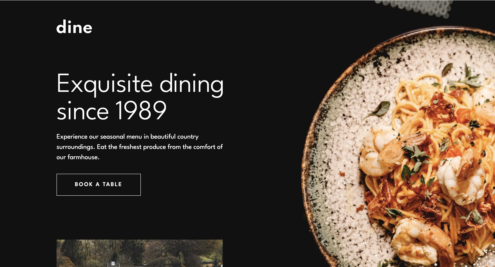

# Frontend Mentor - Dine Website Challenge solution

This is a solution to the [Dine Website Challenge challenge on Frontend Mentor](https://www.frontendmentor.io/challenges/dine-restaurant-website-yAt7Vvxt7). Frontend Mentor challenges help you improve your coding skills by building realistic projects.

### The challenge

Users should be able to:

- View the optimal layout for each page depending on their device's screen size
- See hover states for all interactive elements throughout the site
- See the correct content for the Family Gatherings, Special Events, and Social Events section when the user clicks each tab
- Receive an error message when the booking form is submitted if:
  - The `Name` or `Email Address` fields are empty should show "This field is required"
  - The `Email Address` is not formatted correctly should show "Please use a valid email address"
  - Any of the `Pick a date` or `Pick a time` fields are empty should show "This field is incomplete"

### Screenshot

### Links

- Solution URL: [frontendmentor](https://www.frontendmentor.io/solutions/responsive-dine-restaurant-website-F8gsK57_O_)
- Live Site URL: [netlify](https://deft-froyo-3bfcdb.netlify.app/)

### Built with

- [React](https://reactjs.org/) - JS library
- [Tailwind CSS](https://tailwindcss.com/) - For styles
